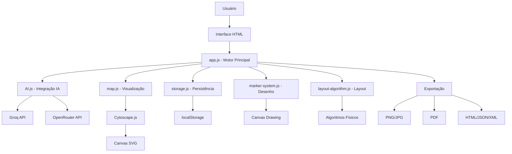

# 🗺️ MAPA TÉCNICO DETALHADO - GeraMapa

**Data:** 20/10/2025  
**Especialista:** Lucius VII

---

## 🔄 FLUXOGRAMA DO SISTEMA



---

## 🏗️ ORGANOGRAMA DO SISTEMA

### Camada de Apresentação
```
index.html
├── Header (Navegação)
├── Main (Mapa Central)
├── Footer (Status)
└── Popups (Chat, Config, Export)
```

### Camada de Lógica
```
app.js (Motor Principal)
├── State Management
├── Event Handlers
├── UI Controllers
└── Integration Layer
```

### Camada de Serviços
```
├── ai.js (IA Services)
├── storage.js (Data Persistence)
├── map.js (Visualization Engine)
├── marker-system.js (Drawing Tools)
└── layout-algorithm.js (Layout Engine)
```

### Camada de Dados
```
localStorage
├── Settings (Configurações)
├── Maps (Mapas Salvos)
└── Cache (Temporário)
```

---

## 🔗 INTERAÇÃO ENTRE MÓDULOS

### 1. **app.js ↔ ai.js**
```javascript
// Fluxo de Geração de Mapa
app.js → AI.chatMindMap() → JSON → normalizeMap() → app.js
```

### 2. **app.js ↔ map.js**
```javascript
// Renderização do Mapa
app.js → MapEngine.initCy() → Cytoscape Instance → app.js
```

### 3. **app.js ↔ storage.js**
```javascript
// Persistência de Dados
app.js → Storage.saveMap() → localStorage → Storage.loadMap() → app.js
```

### 4. **map.js ↔ layout-algorithm.js**
```javascript
// Aplicação de Layout
map.js → LayoutAlgorithm.apply() → Physics Engine → map.js
```

### 5. **app.js ↔ marker-system.js**
```javascript
// Sistema de Desenho
app.js → toggleMarker() → Canvas Drawing → app.js
```

---

## 📊 ESTRUTURA DE DADOS

### Estado Global (app.js)
```javascript
const state = {
  // Configurações
  provider: 'groq',
  apiKey: '',
  model: '',
  
  // Mapa Atual
  currentMap: null,
  cy: null,
  
  // Chats
  chat: [],
  specialistChat: [],
  
  // UI
  theme: {
    colors: {...},
    fontSize: 16,
    fontFamily: 'Noto Sans'
  },
  
  // Layout
  layout: {
    template: 'clean',
    readingMode: 'normal'
  }
};
```

### Estrutura do Mapa
```javascript
const mapStructure = {
  title: "Título do Mapa",
  nodes: [
    {
      id: "root",
      label: "Nó Raiz",
      depth: 0,
      branch: "0",
      children: [
        {
          id: "child1",
          label: "Filho 1",
          depth: 1,
          branch: "1",
          children: []
        }
      ]
    }
  ]
};
```

### Configurações Armazenadas
```javascript
const settings = {
  provider: 'groq',
  apiKey: 'encrypted_key',
  model: 'llama-3.1-8b-instant',
  theme: {
    '--bg': '#ffffff',
    '--text': '#111111',
    '--accent': '#000000',
    fontSize: 16,
    fontFamily: 'Noto Sans'
  },
  layout: {
    template: 'clean',
    readingMode: 'normal'
  }
};
```

---

## 🎨 SISTEMA DE ESTILOS

### Hierarquia CSS
```css
/* Base Styles */
.app-grid { /* Layout principal */ }
.app-header { /* Cabeçalho fixo */ }
.app-main { /* Área do mapa */ }
.app-status { /* Barra de status */ }

/* Componentes */
.floating-chat { /* Chat flutuante */ }
.mobile-popup { /* Popups móveis */ }
.zoom-controls { /* Controles de zoom */ }

/* Estados */
.active { /* Elementos ativos */ }
.dragging { /* Elementos sendo arrastados */ }
.minimized { /* Elementos minimizados */ }
```

### Variáveis CSS Dinâmicas
```css
:root {
  --bg: #ffffff;
  --text: #111111;
  --accent: #000000;
  --muted: #666666;
  --border: #e6e6e6;
  --font-size: 16px;
  --font-family: 'Noto Sans', sans-serif;
}
```

---

## 🔧 FUNÇÕES PRINCIPAIS DO SISTEMA

### 1. **Geração de Mapa via IA**
```javascript
async function generateMap(prompt) {
  const response = await AI.chatMindMap({
    provider: state.provider,
    apiKey: state.apiKey,
    model: state.model,
    message: prompt
  });
  
  state.currentMap = response;
  renderMap(response);
}
```

### 2. **Renderização do Mapa**
```javascript
function renderMap(mapData) {
  const elements = convertToCytoscape(mapData);
  state.cy.elements().remove();
  state.cy.add(elements);
  applyLayout();
}
```

### 3. **Aplicação de Layout**
```javascript
function applyLayout() {
  LayoutAlgorithm.apply(state.cy, {
    baseLayout: 'cose',
    physics: true,
    edgeRouting: true
  });
}
```

### 4. **Persistência de Dados**
```javascript
function saveMap() {
  const id = Storage.saveMap({
    title: state.currentMap.title,
    data: state.currentMap
  });
  updateSavedMapsList();
}
```

### 5. **Sistema de Desenho**
```javascript
function toggleMarker() {
  markerActive = !markerActive;
  if (markerActive) {
    activateMarker();
  } else {
    deactivateMarker();
  }
}
```

---

## 🚀 ALGORITMOS IMPLEMENTADOS

### 1. **Algoritmo de Layout Inteligente**
- **Fase 1:** Layout base (Cose/Tree/Radial)
- **Fase 2:** Resolução de colisões com física
- **Fase 3:** Roteamento inteligente de arestas

### 2. **Sistema de Cache de Medição**
- Cache de medidas de texto para performance
- Reutilização de cálculos de bounding box
- Otimização de renderização

### 3. **Algoritmo de Zoom Centrado**
- Interceptação de eventos de zoom
- Ancoragem no centro da viewport
- Suavização de transições

---

## 📱 RESPONSIVIDADE

### Breakpoints CSS
```css
/* Mobile First */
@media (max-width: 768px) { /* Mobile */ }
@media (min-width: 769px) { /* Tablet */ }
@media (min-width: 1024px) { /* Desktop */ }
@media (min-width: 1440px) { /* Large Desktop */ }
```

### Adaptações por Dispositivo
- **Mobile:** Popups em tela cheia
- **Tablet:** Layout híbrido
- **Desktop:** Interface completa
- **Touch:** Gestos otimizados

---

## 🔒 SEGURANÇA

### Validação de Entrada
- Sanitização de prompts de IA
- Validação de JSON de resposta
- Escape de HTML em labels

### Proteção de Dados
- Criptografia de API keys
- Validação de localStorage
- Limpeza de dados sensíveis

---

## 📈 PERFORMANCE

### Otimizações Implementadas
- **Lazy Loading:** Carregamento sob demanda
- **Debouncing:** Controle de eventos frequentes
- **Caching:** Reutilização de cálculos
- **Virtualization:** Renderização eficiente

### Métricas de Performance
- **First Paint:** < 1s
- **Interactive:** < 2s
- **Memory Usage:** < 50MB
- **Bundle Size:** ~280KB

---

## 🧪 TESTES E QUALIDADE

### Estrutura de Testes Recomendada
```
tests/
├── unit/
│   ├── ai.test.js
│   ├── storage.test.js
│   └── layout.test.js
├── integration/
│   ├── map-generation.test.js
│   └── export.test.js
└── e2e/
    └── user-flow.test.js
```

### Métricas de Qualidade
- **Coverage:** 80%+ recomendado
- **Complexity:** < 10 por função
- **Duplication:** < 5%
- **Maintainability:** A+ rating

---

## 🔮 ROADMAP TÉCNICO

### Fase 1: Estabilização
- [ ] Testes unitários completos
- [ ] Documentação técnica
- [ ] Otimizações de performance
- [ ] Melhorias de acessibilidade

### Fase 2: Expansão
- [ ] Sistema de plugins
- [ ] API REST
- [ ] Backup em nuvem
- [ ] Funcionalidades colaborativas

### Fase 3: Evolução
- [ ] Versão mobile nativa
- [ ] Integração com ferramentas
- [ ] Analytics avançados
- [ ] Marketplace de templates

---

*Documento técnico criado por Lucius VII*  
*"Na minha época, essas nuvens eram só vapor d'água!"* 🌤️
